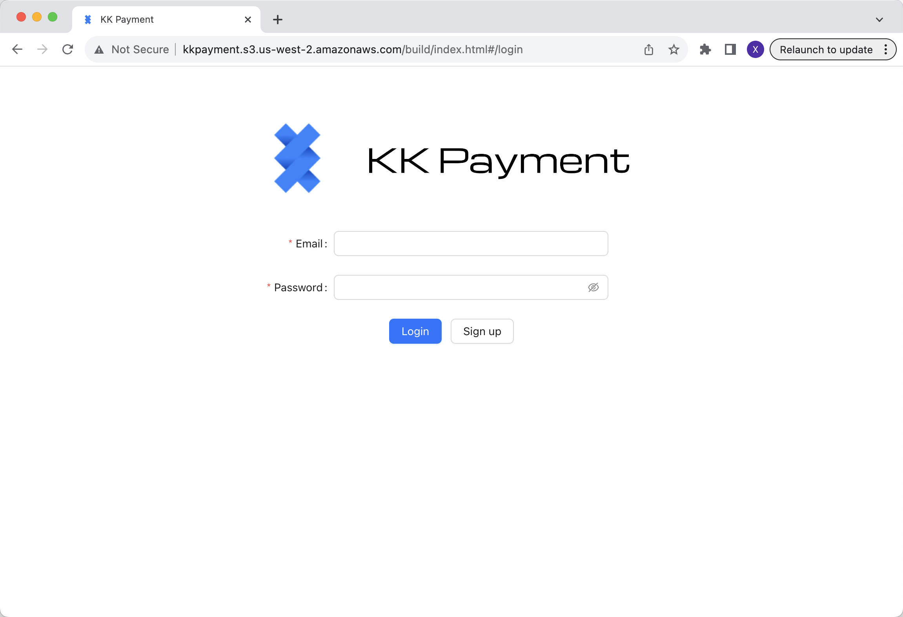
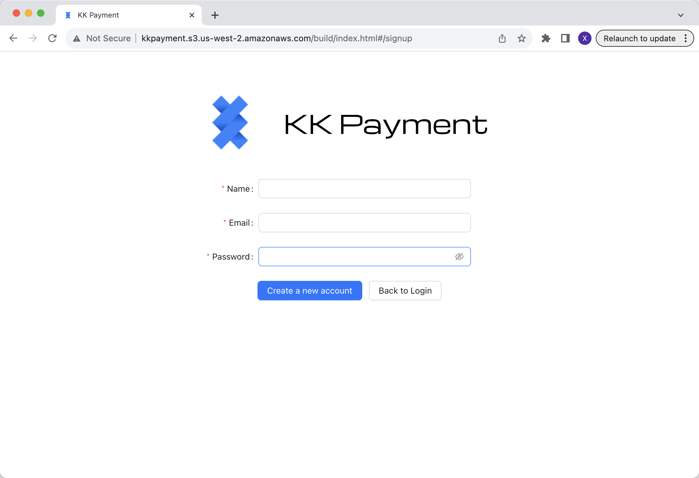
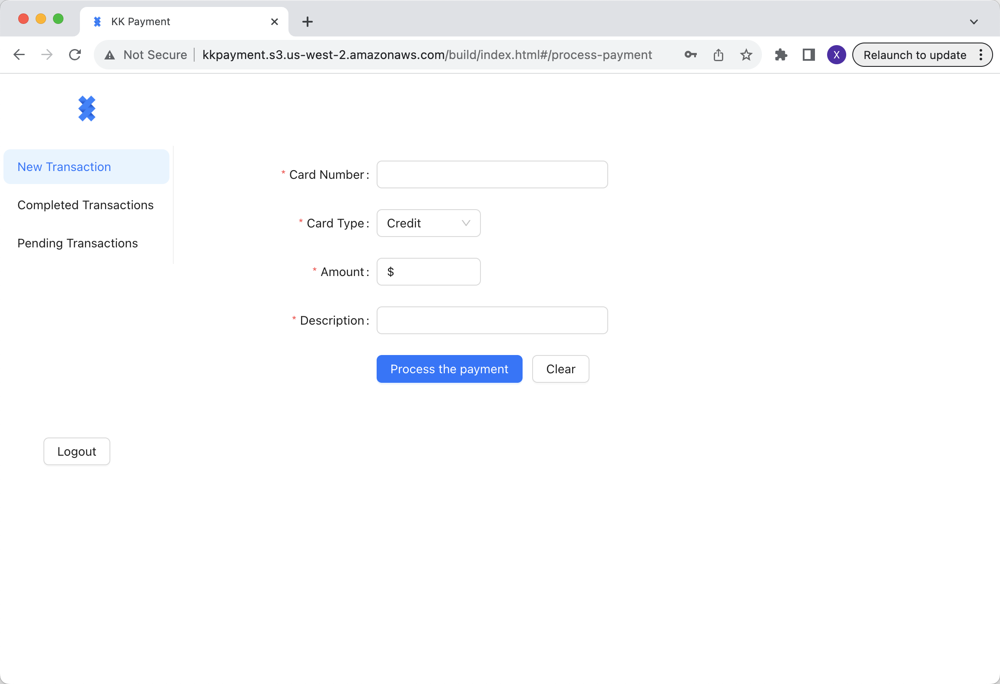
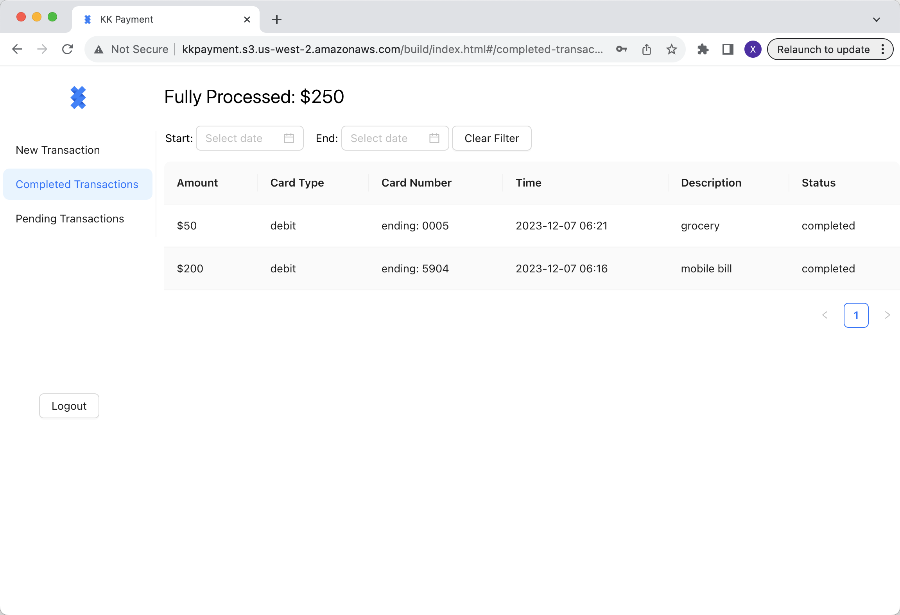
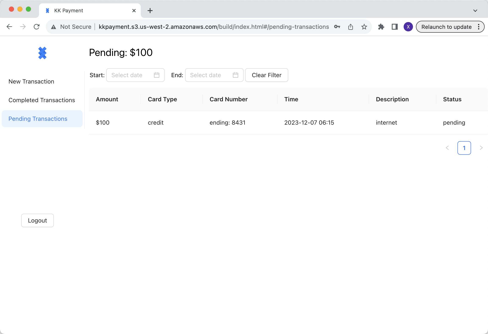

## BugBush

# App url:

```
http://kkpayment.s3.us-west-2.amazonaws.com/build/index.html
```

# Screenshots:

login:

signup:

process a new transaction:

view completed transactions:

view pending transactions:


# Github Issues page:

```
https://github.com/5500-team-krusty-krab/opp-api/blob/master/.github/ISSUE_TEMPLATE/bug_report.md
```
